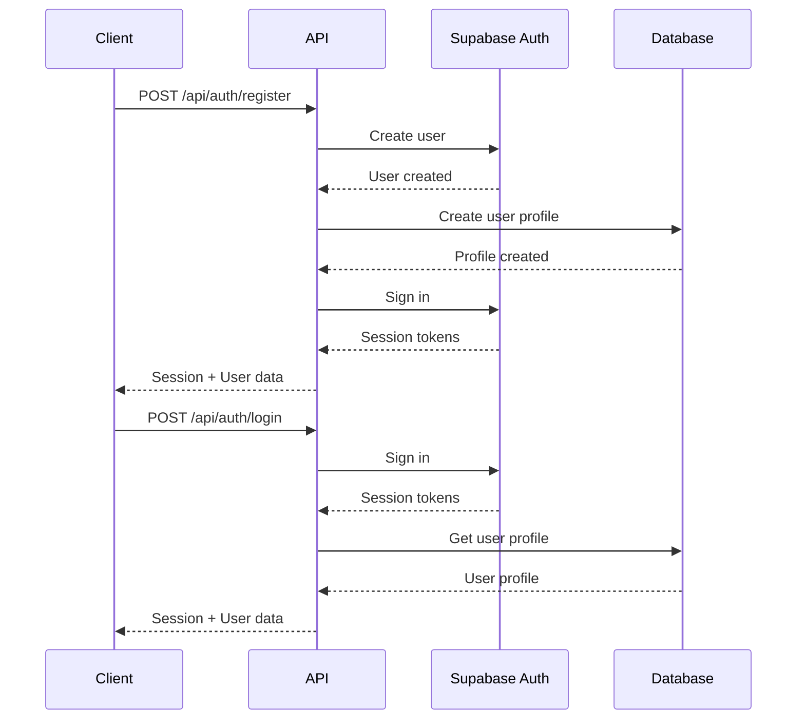
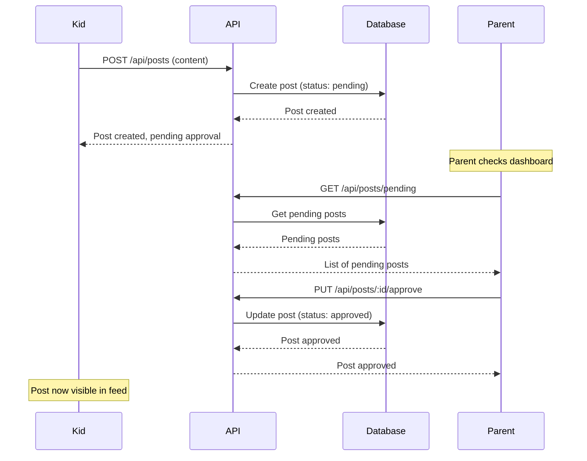

# FamilyNova - Comprehensive MVP & Production Readiness Assessment

**Assessment Date:** December 2024  
**Version:** 1.0  
**Prepared for:** FamilyNova Development Team

---

## Executive Summary

FamilyNova is a safe social networking platform for children with parent moderation capabilities. The application consists of a Node.js/Express backend API, iOS and Android mobile applications (both parent and kids variants), and a Next.js web application.

### Key Findings

**Overall Status:** 🟡 **MVP-Ready with Critical Security & Compliance Gaps**

- **Development Progress:** ~75% complete toward MVP
- **Architecture:** Well-structured monorepo with clear separation of concerns
- **Security:** ⚠️ **CRITICAL** - Multiple high-severity vulnerabilities identified
- **GDPR Compliance:** ⚠️ **PARTIAL** - Policy exists but implementation gaps remain
- **Code Quality:** Good structure but needs hardening for production
- **UK Market Fit:** Strong differentiation potential with proper execution

### Priority Actions Required

1. **CRITICAL (Before MVP Launch):**
   - Implement rate limiting on all API endpoints
   - Add input sanitization to prevent XSS
   - Secure environment variable handling
   - Implement GDPR data export/deletion endpoints
   - Add comprehensive error logging (without exposing sensitive data)

2. **HIGH (Before Production):**
   - Complete GDPR compliance implementation
   - Security audit of file upload functionality
   - Implement CSRF protection
   - Add API versioning
   - Comprehensive testing suite

3. **MEDIUM (Post-MVP):**
   - Performance optimization
   - Enhanced monitoring and analytics
   - Advanced moderation features
   - School integration features

---

## 1. Development Stage Assessment

### 1.1 Current Development Progress

#### ✅ Completed Features

**Backend API (85% Complete)**
- ✅ User authentication (Supabase Auth integration)
- ✅ User registration and login
- ✅ Posts creation, approval, and moderation
- ✅ Comments system
- ✅ Reactions/emojis system
- ✅ Messaging system with parent moderation
- ✅ Friend requests and connections
- ✅ Profile management
- ✅ File upload (images)
- ✅ Parent dashboard
- ✅ School verification system (structure in place)
- ✅ Subscription management (structure in place)

**iOS Parent App (80% Complete)**
- ✅ Authentication flow
- ✅ Home feed with posts
- ✅ Profile management
- ✅ Friends management
- ✅ Messages with moderation
- ✅ Post approval workflow
- ✅ Real-time service (polling)
- ✅ Notification management
- ✅ Design system (Cosmic theme)

**iOS Kids App (75% Complete)**
- ✅ Authentication flow
- ✅ Home feed
- ✅ Profile view
- ✅ Friends management
- ✅ Messages
- ✅ Post creation
- ✅ Comments
- ✅ Design system sync

**Android Kids App (60% Complete)**
- ✅ Project structure (Kotlin + Jetpack Compose)
- ✅ Authentication flow
- ✅ Login screen
- ✅ Home feed screen (UI complete)
- ✅ Design system
- ✅ DataManager implementation
- ⚠️ API integration partially complete
- ⚠️ Missing: Comments, Reactions, Messages, Profile screens

**Web Application (40% Complete)**
- ✅ Landing page
- ✅ Privacy policy page
- ✅ Basic routing structure
- ⚠️ Missing: Authentication integration, Dashboard, Kids/Parent portals

#### 🚧 In Progress / Partially Complete

1. **Real-time Features**
   - Friend request polling (30-second intervals) - needs webhook implementation
   - Message notifications - basic implementation exists

2. **Moderation Tools**
   - Post approval workflow - ✅ Complete
   - Message moderation - ✅ Complete
   - Advanced content filtering - ⚠️ Not implemented

3. **School Integration**
   - School verification - structure exists, needs completion
   - Educational content - structure exists, needs implementation

#### ❌ Missing for MVP

1. **Critical Features**
   - Rate limiting on API endpoints
   - Comprehensive input validation
   - Error handling improvements
   - API documentation
   - Automated testing suite

2. **GDPR Compliance**
   - Data export endpoint
   - Data deletion endpoint
   - Consent management system
   - Data retention policies (automated)

3. **Security Enhancements**
   - CSRF protection
   - API key rotation mechanism
   - Security headers (some missing)
   - File upload validation improvements

4. **Monitoring & Analytics**
   - Error tracking (Sentry, etc.)
   - Performance monitoring
   - User analytics (privacy-compliant)

### 1.2 MVP Readiness Gap Analysis

| Feature Category | MVP Status | Production Status | Gap |
|-----------------|------------|-------------------|-----|
| Core Functionality | 85% | 70% | 15% |
| Security | 40% | 30% | 60% |
| GDPR Compliance | 50% | 40% | 50% |
| Testing | 10% | 5% | 90% |
| Documentation | 30% | 25% | 70% |
| Monitoring | 20% | 15% | 80% |

**Estimated Effort to MVP:** 3-4 weeks (1 developer)  
**Estimated Effort to Production:** 8-12 weeks (2 developers)

### 1.3 Roadmap to Production

#### Phase 1: MVP Hardening (3-4 weeks)
- [ ] Implement rate limiting
- [ ] Add comprehensive input validation
- [ ] Complete GDPR data export/deletion
- [ ] Security fixes (see Security Audit section)
- [ ] Basic error logging
- [ ] Complete Android kids app core features
- [ ] API documentation (OpenAPI/Swagger)

#### Phase 2: Production Preparation (4-6 weeks)
- [ ] Comprehensive testing suite (unit, integration, e2e)
- [ ] Performance optimization
- [ ] Advanced security measures
- [ ] Complete GDPR compliance
- [ ] Monitoring and alerting
- [ ] Load testing
- [ ] Security penetration testing

#### Phase 3: Launch & Post-Launch (Ongoing)
- [ ] User feedback integration
- [ ] Advanced moderation features
- [ ] School integration completion
- [ ] Analytics implementation
- [ ] Continuous security monitoring

---

## 2. UK Market Impact Analysis

### 2.1 Market Positioning

**Target Market:** UK families with children aged 8-16 seeking safe social networking alternatives.

**Unique Value Propositions:**
1. **Two-Tick Verification System** - Parent + School verification ensures identity authenticity
2. **Parent-Led Moderation** - Parents have full visibility and control
3. **Zero Advertising** - No third-party data sharing or targeted ads
4. **GDPR Compliant** - Built with UK GDPR compliance in mind
5. **Educational Integration** - Direct school content delivery

### 2.2 Competitive Advantages

**vs. Traditional Social Media (Instagram, TikTok, Snapchat)**
- ✅ Age-appropriate environment
- ✅ Parent oversight and control
- ✅ No advertising or data harvesting
- ✅ Educational content integration
- ✅ Identity verification

**vs. Other Kids' Social Platforms**
- ✅ Two-tick verification (parent + school) - unique in market
- ✅ Real-time parent moderation
- ✅ School integration for educational content
- ✅ Modern, engaging UI/UX
- ✅ Cross-platform (iOS, Android, Web)

### 2.3 UK Market Fit

**Strengths:**
- Strong focus on child safety aligns with UK parental concerns
- GDPR compliance addresses UK/EU regulatory requirements
- School integration appeals to UK education system
- Growing awareness of online safety for children

**Market Opportunities:**
- UK has ~8.5 million children aged 8-16
- Growing parental concern about social media safety
- Government initiatives promoting online safety
- School partnerships potential

**Challenges:**
- Need to build trust with parents
- Competition from established platforms
- User acquisition costs
- School partnership development

### 2.4 UK-Specific Considerations

#### Regulatory Compliance
- ✅ **GDPR/UK GDPR:** Privacy policy exists, implementation needs completion
- ⚠️ **ICO Registration:** May be required if processing children's data at scale
- ⚠️ **Age-Appropriate Design Code (ICO):** Need to ensure compliance with UK's Age-Appropriate Design Code
- ⚠️ **Online Safety Act 2023:** Platform may need to comply with new UK online safety regulations

#### Cultural Considerations
- ✅ English language support
- ⚠️ Regional content moderation (UK-specific slang, cultural references)
- ⚠️ School calendar integration (UK term dates)
- ⚠️ UK-specific educational content

#### Market Entry Strategy
1. **Phase 1:** Beta launch with select schools (3-6 months)
2. **Phase 2:** Regional expansion (6-12 months)
3. **Phase 3:** National rollout (12-18 months)

**Estimated Time to Market:** 6-9 months from MVP completion

---

## 3. Architecture Documentation

### 3.1 System Architecture Overview

```
┌─────────────────────────────────────────────────────────────┐
│                     Client Applications                      │
├──────────────┬──────────────┬──────────────┬────────────────┤
│ iOS Parent   │ iOS Kids     │ Android Kids │ Web (Next.js)  │
│ (SwiftUI)    │ (SwiftUI)    │ (Jetpack     │ (TypeScript)   │
│              │              │ Compose)     │                │
└──────┬───────┴──────┬───────┴──────┬───────┴────────────────┘
       │              │              │
       └──────────────┴──────────────┘
                      │
              ┌───────▼────────┐
              │   API Gateway  │
              │  (Express.js)  │
              └───────┬────────┘
                      │
       ┌──────────────┼──────────────┐
       │              │              │
┌──────▼──────┐ ┌─────▼─────┐ ┌─────▼─────┐
│  Supabase   │ │ Supabase  │ │ Supabase   │
│    Auth     │ │ Database  │ │  Storage   │
│             │ │(PostgreSQL)│ │            │
└─────────────┘ └───────────┘ └────────────┘
```

### 3.2 Technology Stack

#### Backend
- **Runtime:** Node.js
- **Framework:** Express.js 4.18.2
- **Database:** Supabase (PostgreSQL)
- **Authentication:** Supabase Auth
- **Storage:** Supabase Storage
- **Security:** Helmet, CORS, bcryptjs
- **Validation:** express-validator
- **File Upload:** Multer

#### iOS Apps
- **Language:** Swift
- **Framework:** SwiftUI
- **Architecture:** MVVM-like pattern
- **Networking:** URLSession
- **Storage:** UserDefaults, Keychain (for tokens)
- **Design System:** Custom "Cosmic" design system

#### Android Apps
- **Language:** Kotlin
- **UI Framework:** Jetpack Compose
- **Architecture:** MVVM (ViewModel + StateFlow)
- **Networking:** Retrofit + OkHttp
- **Storage:** DataStore (replacing SharedPreferences)
- **Image Loading:** Coil
- **Design System:** Custom "Cosmic" design system

#### Web Application
- **Framework:** Next.js 14
- **Language:** TypeScript
- **Styling:** Tailwind CSS
- **State Management:** React Query (planned)

### 3.3 Database Schema

#### Core Tables

**users**
- `id` (UUID, PK, references auth.users)
- `email` (VARCHAR, UNIQUE)
- `user_type` (VARCHAR: 'kid', 'parent', 'school')
- `profile` (JSONB)
- `verification` (JSONB)
- `monitoring_level` (VARCHAR: 'full', 'partial')
- `is_active` (BOOLEAN)

**posts**
- `id` (UUID, PK)
- `author_id` (UUID, FK → users)
- `content` (TEXT)
- `image_url` (TEXT)
- `status` (VARCHAR: 'pending', 'approved', 'rejected')
- `visible_to_children` (BOOLEAN)
- `visible_to_adults` (BOOLEAN)
- `approved_adults` (JSONB array)

**comments**
- `id` (UUID, PK)
- `post_id` (UUID, FK → posts)
- `author_id` (UUID, FK → users)
- `content` (TEXT, 1-200 chars)

**reactions**
- `id` (UUID, PK)
- `post_id` (UUID, FK → posts)
- `user_id` (UUID, FK → users)
- `reaction_type` (VARCHAR)
- `emoji` (VARCHAR)

**messages**
- `id` (UUID, PK)
- `sender_id` (UUID, FK → users)
- `receiver_id` (UUID, FK → users)
- `content` (TEXT)
- `status` (VARCHAR: 'pending', 'approved', 'rejected', 'flagged')

**friendships**
- `user_id` (UUID, FK → users)
- `friend_id` (UUID, FK → users)
- `status` (VARCHAR: 'pending', 'accepted', 'blocked')

**parent_children**
- `parent_id` (UUID, FK → users)
- `child_id` (UUID, FK → users)

### 3.4 API Architecture

#### Authentication Flow



#### API Endpoints

**Authentication**
- `POST /api/auth/register` - Register new user
- `POST /api/auth/login` - Login user
- `POST /api/auth/refresh` - Refresh token
- `POST /api/auth/logout` - Logout
- `GET /api/auth/me` - Get current user
- `POST /api/auth/login-code` - QR code login

**Posts**
- `GET /api/posts` - Get posts (with filtering)
- `GET /api/posts?userId=:id` - Get user's posts
- `GET /api/posts/pending` - Get pending posts (parent only)
- `POST /api/posts` - Create post
- `PUT /api/posts/:id/approve` - Approve/reject post (parent only)
- `POST /api/posts/:id/comment` - Add comment
- `POST /api/posts/:id/reaction` - Add reaction
- `DELETE /api/posts/:id` - Delete post

**Messages**
- `GET /api/messages` - Get messages
- `POST /api/messages` - Send message
- `PUT /api/messages/:id/moderate` - Moderate message (parent only)

**Friends**
- `GET /api/friends` - Get friends list
- `GET /api/friends/my-code` - Get friend code
- `POST /api/friends/add-by-code` - Add friend by code
- `POST /api/friends/request` - Send friend request
- `PUT /api/friends/:id/accept` - Accept friend request
- `DELETE /api/friends/:id` - Remove friend

**Upload**
- `POST /api/upload/profile-picture` - Upload avatar
- `POST /api/upload/banner` - Upload banner
- `POST /api/upload/post-image` - Upload post image

### 3.5 Data Flow

#### Post Creation Flow (Kid)



### 3.6 Authentication & Authorization

**Authentication:**
- Uses Supabase Auth for user authentication
- JWT tokens (access_token + refresh_token)
- Token verification via Supabase Auth API

**Authorization:**
- Role-based access control (kid, parent, school)
- Middleware: `auth` - verifies token
- Middleware: `requireUserType` - checks user type
- Resource-level authorization (e.g., parents can only moderate their children's content)

### 3.7 Third-Party Integrations

**Supabase**
- Authentication
- Database (PostgreSQL)
- Storage (file uploads)
- Real-time subscriptions (potential, not fully utilized)

**Future Integrations:**
- Payment processing (subscriptions)
- Email service (notifications)
- Push notifications (FCM/APNs)
- Analytics (privacy-compliant)

### 3.8 Deployment Architecture

**Current:**
- Backend: Vercel (serverless functions)
- Database: Supabase (managed PostgreSQL)
- Storage: Supabase Storage
- Mobile: App Store / Play Store

**Recommended Production:**
- Backend: Vercel or AWS Lambda (serverless) OR dedicated server
- Database: Supabase (managed) OR self-hosted PostgreSQL
- CDN: Cloudflare or AWS CloudFront
- Monitoring: Sentry, DataDog, or similar
- Logging: Centralized logging service

### 3.9 Scalability Considerations

**Current Bottlenecks:**
1. **Database Queries:** Some N+1 query patterns in posts endpoint
2. **File Uploads:** No CDN for image delivery
3. **Real-time Features:** Polling-based (inefficient)
4. **Rate Limiting:** Not implemented

**Scalability Improvements Needed:**
1. Implement database query optimization
2. Add CDN for static assets
3. Implement WebSockets or Supabase Realtime for real-time features
4. Add caching layer (Redis)
5. Implement rate limiting
6. Database connection pooling optimization

---

## 4. Security Audit

### 4.1 Critical Vulnerabilities

#### 🔴 CRITICAL: Missing Rate Limiting
**Severity:** Critical  
**Location:** All API endpoints  
**Description:** No rate limiting implemented, vulnerable to brute force attacks and DoS.

**Impact:**
- Brute force attacks on login endpoints
- DoS attacks on any endpoint
- Resource exhaustion

**Recommendation:**
```javascript
const rateLimit = require('express-rate-limit');

const apiLimiter = rateLimit({
  windowMs: 15 * 60 * 1000, // 15 minutes
  max: 100 // limit each IP to 100 requests per windowMs
});

const authLimiter = rateLimit({
  windowMs: 15 * 60 * 1000,
  max: 5 // limit login attempts
});

app.use('/api/', apiLimiter);
app.use('/api/auth/login', authLimiter);
app.use('/api/auth/register', authLimiter);
```

**Effort:** 2-4 hours

#### 🔴 CRITICAL: XSS Vulnerability
**Severity:** Critical  
**Location:** User-generated content (posts, comments, messages)  
**Description:** No input sanitization for HTML/JavaScript in user content.

**Impact:**
- Stored XSS attacks
- Session hijacking
- Data theft

**Recommendation:**
- Use `DOMPurify` or similar for HTML sanitization
- Escape all user input before rendering
- Implement Content Security Policy (CSP) headers

**Effort:** 4-6 hours

#### 🔴 CRITICAL: Weak Encryption Key Default
**Severity:** Critical  
**Location:** `backend/src/utils/encryption.js:6`  
**Description:** Default encryption key is hardcoded and weak.

```javascript
const ENCRYPTION_KEY = process.env.ENCRYPTION_KEY || 'your-32-byte-encryption-key-here-must-match-backend';
```

**Impact:**
- Data encryption can be easily broken
- Sensitive data exposure

**Recommendation:**
- Remove default key
- Require ENCRYPTION_KEY environment variable
- Generate strong keys: `crypto.randomBytes(32).toString('hex')`
- Use key management service (AWS KMS, etc.)

**Effort:** 1-2 hours

#### 🔴 CRITICAL: CORS Configuration Too Permissive
**Severity:** Critical  
**Location:** `backend/src/server.js:37-40`  
**Description:** CORS allows all origins in production.

```javascript
app.use(cors({
  origin: process.env.CORS_ORIGIN || '*',
  credentials: true
}));
```

**Impact:**
- CSRF attacks
- Unauthorized API access

**Recommendation:**
```javascript
const allowedOrigins = process.env.CORS_ORIGIN 
  ? process.env.CORS_ORIGIN.split(',')
  : ['http://localhost:3000'];

app.use(cors({
  origin: (origin, callback) => {
    if (!origin || allowedOrigins.includes(origin)) {
      callback(null, true);
    } else {
      callback(new Error('Not allowed by CORS'));
    }
  },
  credentials: true
}));
```

**Effort:** 1 hour

### 4.2 High Severity Issues

#### 🟠 HIGH: Missing CSRF Protection
**Severity:** High  
**Location:** All state-changing endpoints  
**Description:** No CSRF tokens implemented.

**Recommendation:**
- Implement CSRF tokens for state-changing operations
- Use `csurf` middleware or similar
- Mobile apps should use token-based auth (already implemented)

**Effort:** 4-6 hours

#### 🟠 HIGH: File Upload Security
**Severity:** High  
**Location:** `backend/src/routes/upload.js`  
**Description:** 
- Only checks MIME type (can be spoofed)
- No file content validation
- No virus scanning
- Large file size limit (5MB) but no rate limiting

**Recommendation:**
- Validate file magic numbers (file signatures)
- Implement virus scanning (ClamAV, etc.)
- Add file type restrictions beyond MIME type
- Implement per-user upload rate limiting

**Effort:** 8-12 hours

#### 🟠 HIGH: SQL Injection Risk (Low, but present)
**Severity:** High (Low actual risk due to Supabase)  
**Location:** Supabase queries  
**Description:** Using Supabase client reduces risk, but some string concatenation in queries.

**Example:**
```javascript
.or(`and(user_id.eq.${req.user.id},friend_id.eq.${receiverId}),...`)
```

**Recommendation:**
- Use parameterized queries consistently
- Avoid string interpolation in queries
- Use Supabase's query builder methods

**Effort:** 2-4 hours

#### 🟠 HIGH: Sensitive Data in Logs
**Severity:** High  
**Location:** Throughout codebase  
**Description:** Error logs may contain sensitive information (tokens, user data).

**Recommendation:**
- Sanitize logs before output
- Use structured logging
- Implement log rotation and retention policies
- Never log passwords, tokens, or PII

**Effort:** 4-6 hours

#### 🟠 HIGH: Missing Input Validation
**Severity:** High  
**Location:** Various endpoints  
**Description:** Some endpoints lack comprehensive input validation.

**Recommendation:**
- Use express-validator consistently
- Validate all inputs (type, length, format)
- Sanitize inputs
- Implement request size limits

**Effort:** 6-8 hours

### 4.3 Medium Severity Issues

#### 🟡 MEDIUM: Weak Password Requirements
**Severity:** Medium  
**Location:** `backend/src/routes/auth.js:14`  
**Description:** Minimum password length is only 6 characters.

**Recommendation:**
- Increase minimum length to 8-12 characters
- Require complexity (uppercase, lowercase, numbers, symbols)
- Implement password strength meter
- Consider password breach checking (Have I Been Pwned API)

**Effort:** 2-4 hours

#### 🟡 MEDIUM: Token Storage Security
**Severity:** Medium  
**Location:** Mobile apps  
**Description:** Need to verify tokens are stored securely (Keychain on iOS, EncryptedSharedPreferences on Android).

**Recommendation:**
- Audit mobile app token storage
- Ensure Keychain usage on iOS
- Ensure EncryptedSharedPreferences on Android
- Implement token refresh mechanism

**Effort:** 4-6 hours

#### 🟡 MEDIUM: Missing Security Headers
**Severity:** Medium  
**Location:** `backend/src/server.js`  
**Description:** Helmet is used but CSP is disabled.

**Recommendation:**
- Enable and configure CSP
- Add HSTS header
- Add X-Frame-Options
- Add X-Content-Type-Options

**Effort:** 2-3 hours

#### 🟡 MEDIUM: No API Versioning
**Severity:** Medium  
**Location:** API routes  
**Description:** No versioning strategy, breaking changes will affect all clients.

**Recommendation:**
- Implement API versioning (`/api/v1/...`)
- Maintain backward compatibility
- Deprecation strategy

**Effort:** 4-6 hours

### 4.4 Low Severity Issues

#### 🟢 LOW: Dependency Vulnerabilities
**Severity:** Low  
**Description:** Need to audit npm dependencies for known vulnerabilities.

**Recommendation:**
- Run `npm audit`
- Update vulnerable dependencies
- Implement automated dependency scanning (Dependabot, Snyk)

**Effort:** 2-4 hours

#### 🟢 LOW: Error Message Information Disclosure
**Severity:** Low  
**Location:** Error handlers  
**Description:** Stack traces exposed in development mode (acceptable, but ensure not in production).

**Recommendation:**
- Ensure NODE_ENV is set correctly
- Generic error messages in production
- Detailed errors only in development

**Effort:** 1 hour

### 4.5 Security Best Practices Checklist

- [ ] Rate limiting implemented
- [ ] Input validation and sanitization
- [ ] CSRF protection
- [ ] Secure file uploads
- [ ] Strong encryption keys
- [ ] Secure token storage
- [ ] Security headers configured
- [ ] Error handling (no information disclosure)
- [ ] Dependency vulnerability scanning
- [ ] Regular security audits
- [ ] Penetration testing
- [ ] Incident response plan

---

## 5. Bug Detection & Code Quality

### 5.1 Identified Bugs

#### 🔴 CRITICAL BUGS

**Bug #1: Race Condition in Friend Request Acceptance**
**Location:** `backend/src/routes/friends.js:76-100`  
**Description:** Multiple simultaneous friend requests could create duplicate friendships.

**Fix:**
```javascript
// Add unique constraint check before insert
const { data: existing, error } = await supabase
  .from('friendships')
  .select('id')
  .or(`and(user_id.eq.${req.user.id},friend_id.eq.${friendId}),and(user_id.eq.${friendId},friend_id.eq.${req.user.id})`)
  .single();

if (existing) {
  // Handle existing friendship
}
```

**Effort:** 2 hours

**Bug #2: Missing Error Handling in File Upload**
**Location:** `backend/src/routes/upload.js`  
**Description:** If storage bucket doesn't exist, error handling is incomplete.

**Fix:** Already has some handling, but needs improvement for edge cases.

**Effort:** 1-2 hours

#### 🟠 HIGH PRIORITY BUGS

**Bug #3: Potential Memory Leak in Polling**
**Location:** `apps/ios-parent/FamilyNovaParent/Services/RealTimeService.swift`  
**Description:** Polling every 30 seconds without proper cleanup could cause memory issues.

**Recommendation:** Implement proper cancellation and cleanup.

**Effort:** 2-3 hours

**Bug #4: Date Parsing Inconsistency**
**Location:** Multiple locations  
**Description:** Different date formats handled inconsistently across platforms.

**Recommendation:** Standardize on ISO8601 with timezone.

**Effort:** 4-6 hours

**Bug #5: Missing Null Checks**
**Location:** Various API endpoints  
**Description:** Some endpoints don't check for null/undefined before accessing properties.

**Example:**
```javascript
const authorProfile = author?.profile || {}; // Good
// But some places don't use optional chaining
```

**Effort:** 4-6 hours

#### 🟡 MEDIUM PRIORITY BUGS

**Bug #6: Inconsistent Error Responses**
**Location:** Throughout API  
**Description:** Error response format varies between endpoints.

**Recommendation:** Standardize error response format.

**Effort:** 6-8 hours

**Bug #7: Missing Transaction Handling**
**Location:** Database operations  
**Description:** Some operations that should be atomic aren't wrapped in transactions.

**Example:** Creating user in Supabase Auth and then in users table - if second fails, orphaned auth user.

**Effort:** 8-12 hours

### 5.2 Code Quality Issues

#### Architecture

**Strengths:**
- ✅ Clear separation of concerns
- ✅ Modular structure
- ✅ Consistent naming conventions
- ✅ Good use of middleware

**Weaknesses:**
- ⚠️ Some code duplication (especially in mobile apps)
- ⚠️ Inconsistent error handling patterns
- ⚠️ Missing abstraction layers in some areas
- ⚠️ Some functions are too long (violate single responsibility)

#### Code Maintainability

**Issues:**
1. **Magic Numbers:** Hardcoded values (e.g., `31536000` for 1 year in seconds)
2. **Inconsistent Patterns:** Some routes use different validation approaches
3. **Missing Comments:** Complex logic lacks documentation
4. **Dead Code:** Some unused imports and functions

**Recommendations:**
- Extract constants to configuration files
- Standardize validation patterns
- Add JSDoc comments for complex functions
- Remove unused code

#### Performance Issues

1. **N+1 Query Problem:** Posts endpoint fetches authors individually
2. **No Caching:** Repeated queries for same data
3. **Large Payloads:** Some endpoints return unnecessary data
4. **Inefficient Polling:** Real-time features use polling instead of WebSockets

### 5.3 Error Handling

**Current State:**
- Basic error handling exists
- Some endpoints have good error handling
- Inconsistent error response formats
- Some errors not logged properly

**Recommendations:**
1. Implement centralized error handler
2. Standardize error response format
3. Add error logging (structured)
4. Implement error tracking (Sentry)

### 5.4 Testing

**Current State:** ⚠️ **CRITICAL GAP**
- No unit tests
- No integration tests
- No E2E tests
- Manual testing only

**Recommendations:**
1. **Unit Tests (Priority: High)**
   - Test models and utilities
   - Test validation logic
   - Test encryption/decryption

2. **Integration Tests (Priority: High)**
   - Test API endpoints
   - Test authentication flow
   - Test database operations

3. **E2E Tests (Priority: Medium)**
   - Test critical user flows
   - Test cross-platform compatibility

**Estimated Effort:** 4-6 weeks for comprehensive test suite

---

## 6. GDPR Compliance Assessment

### 6.1 Lawful Basis for Processing

**Status:** ✅ **COMPLIANT**

**Basis:** 
- Consent (explicit for children, via parents)
- Contractual necessity (service provision)
- Legitimate interests (safety, moderation)

**Evidence:**
- Privacy policy mentions lawful basis
- Parent consent required for children's accounts

**Recommendations:**
- Document lawful basis for each data processing activity
- Maintain consent records

### 6.2 Data Minimization

**Status:** 🟡 **PARTIAL**

**Current State:**
- Only collects necessary data for service
- Some optional fields may not be necessary

**Recommendations:**
- Audit all data fields
- Remove unnecessary data collection
- Implement data retention policies

### 6.3 User Consent Mechanisms

**Status:** 🟡 **PARTIAL**

**Current State:**
- Privacy policy exists
- Parent consent implied for children's accounts
- No explicit consent mechanism in UI

**Recommendations:**
- Add consent checkboxes during registration
- Implement consent management system
- Allow consent withdrawal
- Track consent history

**Effort:** 1-2 weeks

### 6.4 Right to Access (Data Portability)

**Status:** 🔴 **NOT IMPLEMENTED**

**Current State:**
- No endpoint for data export
- No mechanism for users to download their data

**Recommendations:**
- Implement `GET /api/users/me/export` endpoint
- Export data in machine-readable format (JSON)
- Include all user data (posts, messages, profile, etc.)
- Implement data export UI

**Effort:** 1 week

### 6.5 Right to Erasure ("Right to be Forgotten")

**Status:** 🔴 **NOT IMPLEMENTED**

**Current State:**
- No account deletion endpoint
- No data deletion mechanism
- No cascade deletion policies documented

**Recommendations:**
- Implement `DELETE /api/users/me` endpoint
- Delete all user data (posts, messages, comments, etc.)
- Delete from Supabase Auth
- Implement soft delete with retention period (30 days)
- Document deletion process

**Effort:** 1-2 weeks

### 6.6 Right to Rectification

**Status:** ✅ **IMPLEMENTED**

**Current State:**
- Users can update their profiles
- Profile change requests for children (parent approval)

**Recommendations:**
- Ensure all user data is editable
- Add audit trail for data changes

### 6.7 Data Breach Notification Procedures

**Status:** 🔴 **NOT IMPLEMENTED**

**Current State:**
- No breach detection system
- No notification procedures
- No incident response plan

**Recommendations:**
- Implement breach detection
- Create notification procedures (72-hour requirement)
- Document incident response plan
- Test breach response procedures

**Effort:** 1 week

### 6.8 Privacy by Design and by Default

**Status:** 🟡 **PARTIAL**

**Current State:**
- Privacy considerations in architecture
- Some privacy features implemented
- Not all features have privacy as default

**Recommendations:**
- Review all features for privacy impact
- Ensure privacy settings are most restrictive by default
- Implement privacy settings UI
- Regular privacy impact assessments

### 6.9 Data Retention Policies

**Status:** 🔴 **NOT IMPLEMENTED**

**Current State:**
- No automated data retention
- No data deletion schedules
- Privacy policy mentions retention but no implementation

**Recommendations:**
- Implement automated data retention
- Delete inactive accounts after X months
- Delete old data according to policy
- Document retention periods

**Effort:** 1-2 weeks

### 6.10 Third-Party Data Processor Agreements

**Status:** 🟡 **PARTIAL**

**Current State:**
- Using Supabase (need to verify DPA)
- No other third-party processors identified
- Need to document all processors

**Recommendations:**
- Verify Supabase DPA
- Document all third-party processors
- Ensure DPAs are in place
- Regular review of processors

### 6.11 Cookie Consent and Tracking Compliance

**Status:** ✅ **N/A (Mobile-First)**

**Current State:**
- Web app exists but minimal
- No cookies/tracking currently

**Recommendations:**
- If adding analytics, implement cookie consent
- Ensure compliance with UK cookie regulations

### 6.12 Privacy Policy Completeness

**Status:** ✅ **GOOD**

**Current State:**
- Comprehensive privacy policy exists
- Covers GDPR requirements
- Accessible and clear

**Recommendations:**
- Keep policy updated
- Ensure policy matches implementation
- Add data processing details
- Add contact information for DPO

### 6.13 GDPR Compliance Checklist

| Requirement | Status | Priority | Effort |
|------------|--------|----------|--------|
| Lawful basis documented | ✅ Pass | - | - |
| Data minimization | 🟡 Partial | High | 1 week |
| Consent mechanisms | 🟡 Partial | High | 1-2 weeks |
| Right to access | 🔴 Fail | Critical | 1 week |
| Right to erasure | 🔴 Fail | Critical | 1-2 weeks |
| Right to rectification | ✅ Pass | - | - |
| Breach notification | 🔴 Fail | High | 1 week |
| Privacy by design | 🟡 Partial | Medium | Ongoing |
| Data retention | 🔴 Fail | High | 1-2 weeks |
| Third-party DPAs | 🟡 Partial | Medium | 1 week |
| Privacy policy | ✅ Pass | - | - |

**Overall GDPR Compliance:** 🟡 **60%** - Critical gaps need addressing before production

**Estimated Effort to Full Compliance:** 4-6 weeks

---

## 7. Recommendations Summary

### 7.1 Critical (Must Fix Before MVP)

1. **Implement Rate Limiting** (2-4 hours)
2. **Add Input Sanitization** (4-6 hours)
3. **Fix Encryption Key Handling** (1-2 hours)
4. **Fix CORS Configuration** (1 hour)
5. **Implement Data Export Endpoint** (1 week)
6. **Implement Data Deletion Endpoint** (1-2 weeks)

### 7.2 High Priority (Before Production)

1. **CSRF Protection** (4-6 hours)
2. **File Upload Security** (8-12 hours)
3. **Comprehensive Testing Suite** (4-6 weeks)
4. **Error Handling Standardization** (1 week)
5. **GDPR Compliance Completion** (4-6 weeks)
6. **Security Headers Configuration** (2-3 hours)

### 7.3 Medium Priority (Post-MVP)

1. **API Versioning** (4-6 hours)
2. **Performance Optimization** (2-3 weeks)
3. **Advanced Monitoring** (1-2 weeks)
4. **Code Quality Improvements** (2-3 weeks)

### 7.4 Estimated Timeline

**To MVP:** 3-4 weeks (1 developer, full-time)  
**To Production:** 8-12 weeks (2 developers, full-time)

---

## 8. Conclusion

FamilyNova has a solid foundation with good architecture and core functionality. However, **critical security and compliance gaps must be addressed before MVP launch**. The application shows strong potential for the UK market with its unique two-tick verification system and parent-led moderation approach.

**Key Strengths:**
- Well-structured codebase
- Clear architecture
- Good feature set
- Strong market positioning

**Key Weaknesses:**
- Security vulnerabilities
- GDPR compliance gaps
- Missing testing
- Performance optimizations needed

**Recommendation:** Address critical security and GDPR issues before MVP launch. The application is approximately **3-4 weeks away from MVP readiness** with focused effort on security and compliance.

---

**Document Version:** 1.0  
**Last Updated:** December 2024  
**Next Review:** After MVP completion

